# 橘子手机（JUZI PHONE）企业官网数据库设计文档

| 文档属性 | 内容 |
|---|---|
| 文档版本 | v1.1 |
| 编写日期 | 2026-08-26 |
| 文档状态 | 已审核修订（v1.1） |
| 关联文档 | 《橘子手机企业官网PRD.md》v1.3（需求基线）、《橘子手机企业官网开发技术文档.md》v1.0（技术基线）、《橘子手机企业官网UIUX设计文档.md》v1.1（视觉/交互基线） |
| 技术栈 | MySQL 8.0+（InnoDB / utf8mb4）、SQLAlchemy 2.x + Alembic |
| 配套文件 | `schema.sql`（建表脚本）、`数据库设计图片/`（ER 图与状态机图） |

---

## 修订记录

| 版本 | 日期 | 修订人 | 修订说明 |
|---|---|---|---|
| v1.0 | 2026-08-26 | WorkBuddy | 首次定稿：21 张数据表完整定义（数据字典/索引/建表 SQL），与开发技术文档 §5 逐字段对齐；含 ER 图 5 张与留言状态机图 1 张 |
| v1.1 | 2026-08-26 | WorkBuddy | 架构师组长审核修订：①新增 §8.9 认证与令牌存储边界（澄清 refresh token 轮换不落库、role_id 可空语义）；②新增 §8.10 站内搜索与索引边界（LIKE 方案与升级路径）；③§8.6 补充 site_configs 公开接口脱敏说明；④附录 A 补充 pages.page_key、operation_logs.action 枚举；⑤字段级/索引/SQL 双交付交叉核验通过（差异 0） |

---

## 目录

1. [文档概述](#1-文档概述)
2. [设计原则与通用约定](#2-设计原则与通用约定)
3. [概念数据模型](#3-概念数据模型)
4. [逻辑数据模型](#4-逻辑数据模型)
5. [数据字典](#5-数据字典)
6. [索引设计总表](#6-索引设计总表)
7. [建表 SQL](#7-建表-sql)
8. [关键设计说明](#8-关键设计说明)
9. [附录](#9-附录)

---

# 1. 文档概述

## 1.1 文档定位

本文档是橘子手机企业官网（前台官网系统 + 后台管理系统）的**数据库设计文档（Database Design Document）**，向下承接 PRD v1.3 §7 的数据模型需求与《开发技术文档》v1.0 §5 的数据库设计基线，输出可执行的表结构定义与建表脚本。

三份技术类文档的分工：

| 文档 | 回答的问题 |
|---|---|
| PRD v1.3 | 做什么（功能、数据、规则） |
| 开发技术文档 v1.0 | 怎么实现（架构、数据库、接口、流程） |
| **本文档** | **数据长什么样（表结构、关系、索引、DDL）** |

## 1.2 范围基线（已确认）

- **表范围**：21 张业务表，与开发技术文档 §5 一一对应，**不新增、不修改、不删除任何表与字段**。
- **字段范围**：字段名、类型、约束、默认值、索引均严格对齐开发技术文档 §5.3；本文档仅补充字段说明、枚举值、典型示例与设计依据。
- **冲突处理**：若本文档与 PRD 或开发技术文档出现不一致，以**开发技术文档 §5 为唯一技术实现基线**，并需登记修订。

## 1.3 读者对象

| 读者 | 关注章节 |
|---|---|
| 后端工程师 | §2、§5、§6、§7（ORM 建模与 Alembic 迁移依据） |
| DBA | §3、§4、§6、§7、§8 |
| 测试/QA | §5、§8（数据构造与状态验证） |
| 前端工程师 | §5（理解双语字段与枚举，配合接口 DTO） |

## 1.4 术语表

| 术语 | 含义 |
|---|---|
| 逻辑删除 | `deleted_at` 置值代替物理删除，查询默认过滤 `deleted_at IS NULL` |
| 双语字段 | `xxx_zh` / `xxx_en` 存储的内容字段，英文缺失时应用层 `en \|\| zh` 回退 |
| 物理外键 | 数据库层 FOREIGN KEY 约束；本项目默认不建，仅 ORM 逻辑引用 |
| 子资源 | 挂在产品下的版本/图集/参数/亮点/渠道等从属数据 |
| 业务域 | 按业务关系将 21 张表划分的四个分组（认证权限/产品/内容/运营系统） |

---

# 2. 设计原则与通用约定

## 2.1 全局约定

| 项 | 约定 |
|---|---|
| 数据库引擎 | InnoDB |
| 字符集 / 排序规则 | `utf8mb4` / `utf8mb4_unicode_ci`（支持中文 + emoji） |
| 主键 | `id BIGINT UNSIGNED AUTO_INCREMENT`（全部表，PRD §7.2） |
| 时间字段 | 默认 `created_at`、`updated_at` DATETIME NOT NULL，默认 `CURRENT_TIMESTAMP`，更新自动刷新；**例外**：`pages`、`site_configs` 仅含 `updated_at`；`operation_logs` 仅含 `created_at`（日志只读不可变）；`visit_stats` 以 `visit_date` 为时间维度，不设审计时间字段 |
| 逻辑删除 | 核心业务表含 `deleted_at DATETIME NULL`；删除置当前时间；查询默认过滤 |
| 双语字段 | `xxx_zh` / `xxx_en` 均 NOT NULL（英文允许空串），应用层 `en \|\| zh` 回退 |
| 金额 | `DECIMAL(10,2)`，单位人民币元 |
| 状态枚举 | 产品 `status`：1 上架 / 0 下架（无独立草稿态，保存草稿=下架）；案例/新闻 `status`：0 草稿 / 1 已发布 / 2 已下线；其余表见 §9 附录 A |
| 时间精度 | 全部 DATETIME；`published_at` 等可空字段默认 NULL |

## 2.2 命名规范

| 对象 | 规范 | 示例 |
|---|---|---|
| 表名 | 小写下划线复数 | `product_variants` |
| 普通索引 | `idx_<表>_<字段>` | `idx_products_status_series` |
| 唯一索引 | `uk_<表>_<字段>` | `uk_products_slug` |
| 外键引用（逻辑） | 列名语义化 | `product_id`、`series_id`、`replied_by` |

## 2.3 外键策略（已确认）

- **物理外键默认不建**（开发技术文档 §5.4）：表数据量大、删除性能考虑，引用完整性由应用层（SQLAlchemy ORM + service 层事务）保证。
- 外键列仍建立普通索引（复用查询索引，如 `idx_variants_product`）。
- 若后续需强约束，可在对应列补充 FOREIGN KEY 定义（DDL 中已注释参考表）。

## 2.4 逻辑删除与唯一索引的冲突处理

`slug`、`username`、`config_key`、`page_key` 等唯一字段与逻辑删除并存时，删除操作对唯一字段**追加后缀**（如 `slug = slug + '-del-' + id`），避免唯一索引冲突（开发技术文档 §5.4）。

---

# 3. 概念数据模型

系统共 21 张业务表，按业务关系划分为四个域：

| 业务域 | 表 | 说明 |
|---|---|---|
| ① 认证与权限域 | `admin_users`、`roles`、`permissions`、`role_permissions` | 后台管理员、角色与 RBAC 权限点 |
| ② 产品域 | `product_series`、`products`、`product_variants`、`product_images`、`product_specs`、`product_highlights`、`purchase_channels` | 产品主数据 + 5 类子资源 |
| ③ 内容域 | `cases`、`banners`、`news`、`pages`、`faqs`、`service_policies` | 案例、轮播、新闻、页面内容、FAQ、售后政策（均为独立表） |
| ④ 运营与系统域 | `messages`、`site_configs`、`operation_logs`、`visit_stats` | 留言、站点配置、操作日志、访问统计 |



> 图 3-1 数据库总览（21 表按四域分组；实线为聚合/引用关系，虚线为跨域引用）。

**跨域关系仅有两处**（均为弱引用，外键可空）：

- `admin_users → messages.replied_by`（客服回复留言）；
- `admin_users → operation_logs.admin_id`（管理员产生操作日志）。

---

# 4. 逻辑数据模型

## 4.1 认证与权限域



> 图 4-1 认证与权限域。`roles` 与 `permissions` 通过 `role_permissions` 多对多关联；`admin_users.role_id` 指向 `roles`（可空）。

关系说明：

| 关系 | 基数 | 说明 |
|---|---|---|
| roles → admin_users | 1 : n | 一个角色可分配给多个管理员；`role_id` 可空 |
| roles → role_permissions | 1 : n | 一个角色关联多个权限点 |
| permissions → role_permissions | 1 : n | 一个权限点可被多个角色引用 |

## 4.2 产品域



> 图 4-2 产品域。`products` 为聚合根，挂 5 类子资源（版本/图集/参数/亮点/渠道）；`series_id` 可空（无系列产品归入"全部"）。

关系说明：

| 关系 | 基数 | 说明 |
|---|---|---|
| product_series → products | 0/1 : n | 系列包含产品；`series_id` 可空 |
| products → product_variants | 1 : n | 版本（颜色 × 存储组合） |
| products → product_images | 1 : n | 图集（主图标记 + 排序） |
| products → product_specs | 1 : n | 参数规格（分组 + 条目） |
| products → product_highlights | 1 : n | 产品亮点（图文） |
| products → purchase_channels | 1 : n | 购买渠道（启停用） |

## 4.3 内容域



> 图 4-3 内容域。六张表相互独立（无外键）：`cases` 采用 `category_key + category_zh/en` 分类双字段；`banners` 含有效期；`pages` 以 `page_key` 唯一约束每页一条记录。

| 表 | 关键设计点 |
|---|---|
| cases | 行业分类用稳定英文 key（retail/education/manufacturing）做 URL 筛选，展示名中英并列冗余存储 |
| banners | 有效期 `start_at`/`end_at` 可空；展示条件见 §8.4 |
| news | 分类仅两类：`company`（企业新闻）/ `industry`（行业资讯） |
| pages | 6 个固定 `page_key`：about / history / brand / service / career_social / career_campus |
| faqs / service_policies | 均含状态与排序，前台仅展示"上线"记录 |

## 4.4 运营与系统域



> 图 4-4 运营与系统域。`messages.replied_by`、`operation_logs.admin_id` 为跨域弱引用（指向 `admin_users`，可空）；`site_configs` 与 `visit_stats` 为独立表。

| 表 | 关键设计点 |
|---|---|
| messages | 留言状态机流转（0 待处理 → 1 处理中 → 2 已回复，支持撤回重开），详见 §8.5 |
| site_configs | key-value JSON 结构，5 个分组 key：basic / contact / social / footer / maintenance |
| operation_logs | 只读不可删改，保留 90 天 |
| visit_stats | 按 `(page_url, visit_date)` 唯一聚合并日累加，保留 180 天 |

## 4.5 留言状态机



> 图 4-5 留言状态流转（B-MSG-04）：访客提交 → 待处理；客服标记 → 处理中；提交回复 → 已回复；支持"撤回重开"（已回复 → 处理中）与"撤销标记"（处理中 → 待处理）；待处理可直接删除（逻辑删除）。

---

# 5. 数据字典

> 说明：
> 1. 类型列标注 PK/UK/FK；`M` 表示 NOT NULL；`*` 表示该列已确认必填。
> 2. 除特别标注外，各表均含 `created_at`、`updated_at`（默认 `CURRENT_TIMESTAMP`，更新自动刷新），以下不再重复列出。
> 3. "典型示例"列给出 seed 数据（PRD §12）取值，供开发与测试参照。
> 4. 表顺序与开发技术文档 §5.3 完全一致。

## 5.1 admin_users（后台管理员）

| 字段 | 类型 | 约束/默认 | 说明 | 典型示例 |
|---|---|---|---|---|
| id | BIGINT UNSIGNED | PK | 主键 | 1 |
| username | VARCHAR(50) | UK, M | 登录账号 | `admin` |
| password_hash | VARCHAR(255) | M | BCrypt 哈希 | `$2b$12$...` |
| name | VARCHAR(50) | NULL | 姓名 | `系统管理员` |
| email | VARCHAR(100) | NULL | 邮箱 | `admin@juziphone.com` |
| phone | VARCHAR(20) | NULL | 手机号 | `13800000000` |
| avatar | VARCHAR(255) | NULL | 头像 URL | `/uploads/avatars/a.png` |
| role_id | BIGINT UNSIGNED | FK→roles, NULL | 角色（可空） | 1 |
| status | TINYINT | 1 | 1 启用 / 0 禁用 | 1 |
| failed_attempts | INT | 0 | 连续密码失败次数（≥5 锁定） | 0 |
| locked_until | DATETIME | NULL | 账号锁定截止时间（30 分钟） | NULL |
| last_login_at | DATETIME | NULL | 最近登录时间 | `2026-09-01 10:00:00` |

索引：`uk_admin_users_username`；`idx_admin_users_role_id`。

## 5.2 roles（角色）

| 字段 | 类型 | 约束/默认 | 说明 | 典型示例 |
|---|---|---|---|---|
| id | BIGINT UNSIGNED | PK | 主键 | 1 |
| name | VARCHAR(50) | M | 角色名 | `超级管理员` |
| code | VARCHAR(50) | UK, M | 角色编码 | `super_admin` |
| description | VARCHAR(200) | NULL | 描述 | `系统全量管理` |
| is_builtin | TINYINT | 0 | 1=内置（超级管理员，不可删/不可编辑） | 1 |

索引：`uk_roles_code`。预置角色：`super_admin`（超级管理员，内置）、`operator`（内容运营）、`support`（客服）。

## 5.3 permissions（权限点）

| 字段 | 类型 | 约束/默认 | 说明 | 典型示例 |
|---|---|---|---|---|
| id | BIGINT UNSIGNED | PK | 主键 | 1 |
| name | VARCHAR(50) | M | 权限名称 | `产品-查看` |
| code | VARCHAR(50) | UK, M | 权限点编码（`module:action`） | `product:view` |
| module | VARCHAR(50) | M | 所属模块（product/cms/message/user/config/stat/log…） | `product` |
| description | VARCHAR(200) | NULL | 说明 | `查看产品列表与详情` |

索引：`uk_permissions_code`。全量权限点清单见附录 B。

## 5.4 role_permissions（角色-权限关联）

| 字段 | 类型 | 约束/默认 | 说明 | 典型示例 |
|---|---|---|---|---|
| id | BIGINT UNSIGNED | PK | 主键 | 1 |
| role_id | BIGINT UNSIGNED | FK→roles, M | 角色 | 1 |
| permission_id | BIGINT UNSIGNED | FK→permissions, M | 权限点 | 1 |

索引：`uk_role_permissions_role_perm(role_id, permission_id)`（联合唯一，防重复分配）。

## 5.5 products（产品）

| 字段 | 类型 | 约束/默认 | 说明 | 典型示例 |
|---|---|---|---|---|
| id | BIGINT UNSIGNED | PK | 主键 | 1 |
| name_zh | VARCHAR(100) | M | 产品名称（中） | `JUZI 1` |
| name_en | VARCHAR(100) | M | 产品名称（英） | `JUZI 1` |
| slug | VARCHAR(120) | UK, M | 详情页 URL 标识（自动生成可改） | `juzi-1` |
| series_id | BIGINT UNSIGNED | FK→product_series, NULL | 所属系列（可空） | 1 |
| tagline_zh | VARCHAR(200) | NULL | 一句话卖点（中） | `旗舰影像，重构想象` |
| tagline_en | VARCHAR(200) | NULL | 一句话卖点（英） | `Flagship imaging, reimagine` |
| description_zh | TEXT | NULL | 产品简介（中） | `全新一代影像旗舰…` |
| description_en | TEXT | NULL | 产品简介（英） | `The all-new imaging flagship…` |
| price | DECIMAL(10,2) | NULL | 起售价（保存时自动取最低版本价） | `2488.00` |
| launch_date | DATE | NULL | 产品上市日期（前台展示，可空则隐藏） | `2026-09-15` |
| cover_image | VARCHAR(255) | NULL | 封面图 | `/uploads/products/juzi1.png` |
| status | TINYINT | 0 | 1 上架 / 0 下架（保存草稿=下架） | 1 |
| is_featured | TINYINT | 0 | 1 首页推荐（F-HOME-02） | 1 |
| seo_title_zh | VARCHAR(150) | NULL | SEO 标题（中） | `JUZI 1 参数与价格` |
| seo_title_en | VARCHAR(150) | NULL | SEO 标题（英） | `JUZI 1 Specs & Price` |
| seo_desc_zh | VARCHAR(300) | NULL | SEO 描述（中） | `…` |
| seo_desc_en | VARCHAR(300) | NULL | SEO 描述（英） | `…` |
| published_at | DATETIME | NULL | 上架时间（运营动作时间，区别于 launch_date） | `2026-09-10 09:00:00` |
| sort_order | INT | 0 | 排序权重（越小越前） | 1 |
| deleted_at | DATETIME | NULL | 逻辑删除 | NULL |

索引：`uk_products_slug`；`idx_products_status_series(status, series_id)`；`idx_products_featured(is_featured)`；`idx_products_sort(sort_order)`。

## 5.6 product_series（产品系列）

| 字段 | 类型 | 约束/默认 | 说明 | 典型示例 |
|---|---|---|---|---|
| id | BIGINT UNSIGNED | PK | 主键 | 1 |
| name_zh | VARCHAR(100) | M | 系列名（中） | `旗舰系列` |
| name_en | VARCHAR(100) | M | 系列名（英） | `Flagship Series` |
| slug | VARCHAR(120) | UK, M | 筛选参数（URL `?series=`） | `flagship` |
| description_zh | VARCHAR(500) | NULL | 简介（中） | `影像旗舰，重构想象` |
| description_en | VARCHAR(500) | NULL | 简介（英） | `Imaging flagship, reimagine` |
| sort_order | INT | 0 | 排序 | 1 |
| status | TINYINT | 1 | 1 启用 / 0 停用 | 1 |
| deleted_at | DATETIME | NULL | 逻辑删除 | NULL |

索引：`uk_product_series_slug`。预置系列：`flagship` / `x` / `flip` / `trifold`。

## 5.7 product_variants（产品版本：颜色 × 存储）

| 字段 | 类型 | 约束/默认 | 说明 | 典型示例 |
|---|---|---|---|---|
| id | BIGINT UNSIGNED | PK | 主键 | 10 |
| product_id | BIGINT UNSIGNED | FK→products, M | 所属产品 | 1 |
| color_zh | VARCHAR(50) | M | 颜色名（中） | `橘红` |
| color_en | VARCHAR(50) | M | 颜色名（英） | `Tangerine` |
| color_hex | VARCHAR(9) | NULL | 色值（HEX） | `#FF6A00` |
| storage | VARCHAR(20) | M | 存储容量 | `256GB` |
| ram | VARCHAR(20) | NULL | 运行内存 | `12GB` |
| price | DECIMAL(10,2) | M | 该版本价格（后台维护；原型演示按基础价+增额生成） | `2488.00` |
| is_default | TINYINT | 0 | 默认版本标记 | 1 |
| sort_order | INT | 0 | 排序 | 1 |
| deleted_at | DATETIME | NULL | 逻辑删除 | NULL |

索引：`idx_variants_product(product_id, sort_order)`。

## 5.8 product_images（产品图集）

| 字段 | 类型 | 约束/默认 | 说明 | 典型示例 |
|---|---|---|---|---|
| id | BIGINT UNSIGNED | PK | 主键 | 1 |
| product_id | BIGINT UNSIGNED | FK→products, M | 所属产品 | 1 |
| image_url | VARCHAR(255) | M | 图片地址 | `/uploads/products/juzi1.png` |
| is_main | TINYINT | 0 | 主图标记（1=主图） | 1 |
| sort_order | INT | 0 | 排序 | 1 |

索引：`idx_images_product(product_id, sort_order)`。注：本表无 `deleted_at`（随产品整体维护，删除即物理删除子资源）。

## 5.9 product_specs（参数规格）

| 字段 | 类型 | 约束/默认 | 说明 | 典型示例 |
|---|---|---|---|---|
| id | BIGINT UNSIGNED | PK | 主键 | 1 |
| product_id | BIGINT UNSIGNED | FK→products, M | 所属产品 | 1 |
| group_zh | VARCHAR(50) | M | 分组名（中） | `屏幕` |
| group_en | VARCHAR(50) | M | 分组名（英） | `Display` |
| name_zh | VARCHAR(100) | M | 参数名（中） | `尺寸` |
| name_en | VARCHAR(100) | M | 参数名（英） | `Size` |
| value_zh | VARCHAR(255) | M | 参数值（中） | `6.7 英寸` |
| value_en | VARCHAR(255) | M | 参数值（英） | `6.7 inch` |
| sort_order | INT | 0 | 排序 | 1 |

索引：`idx_specs_product(product_id, sort_order)`。注：本表无 `deleted_at`。

## 5.10 product_highlights（产品亮点）

| 字段 | 类型 | 约束/默认 | 说明 | 典型示例 |
|---|---|---|---|---|
| id | BIGINT UNSIGNED | PK | 主键 | 1 |
| product_id | BIGINT UNSIGNED | FK→products, M | 所属产品 | 1 |
| title_zh | VARCHAR(100) | M | 亮点标题（中） | `超感光影像系统` |
| title_en | VARCHAR(100) | M | 亮点标题（英） | `Ultra-Sensing Imaging` |
| description_zh | TEXT | NULL | 描述（中） | `三主摄全焦段…` |
| description_en | TEXT | NULL | 描述（英） | `Triple cameras, all focal…` |
| image_url | VARCHAR(255) | NULL | 配图 | `/uploads/products/h1.png` |
| sort_order | INT | 0 | 排序 | 1 |

索引：`idx_highlights_product(product_id, sort_order)`。注：本表无 `deleted_at`。

## 5.11 purchase_channels（购买渠道）

| 字段 | 类型 | 约束/默认 | 说明 | 典型示例 |
|---|---|---|---|---|
| id | BIGINT UNSIGNED | PK | 主键 | 1 |
| product_id | BIGINT UNSIGNED | FK→products, M | 所属产品 | 1 |
| name_zh | VARCHAR(50) | M | 渠道名（中） | `京东自营` |
| name_en | VARCHAR(50) | M | 渠道名（英） | `JD.com` |
| url | VARCHAR(500) | M | 渠道链接（新窗口打开） | `https://item.jd.com/…` |
| status | TINYINT | 1 | 1 启用 / 0 停用 | 1 |
| sort_order | INT | 0 | 排序 | 1 |

索引：`idx_channels_product(product_id, sort_order)`。注：本表无 `deleted_at`。

## 5.12 cases（应用案例）

| 字段 | 类型 | 约束/默认 | 说明 | 典型示例 |
|---|---|---|---|---|
| id | BIGINT UNSIGNED | PK | 主键 | 1 |
| title_zh | VARCHAR(200) | M | 案例标题（中） | `JUZI 1 助力连锁零售数字化巡检` |
| title_en | VARCHAR(200) | M | 案例标题（英） | `JUZI 1 empowers retail inspection` |
| summary_zh | VARCHAR(500) | NULL | 摘要（中） | `为全国 2,000+ 门店提供统一巡检终端…` |
| summary_en | VARCHAR(500) | NULL | 摘要（英） | `…` |
| content_zh | LONGTEXT | NULL | 富文本正文（中，已 XSS 清洗后存储） | `<h2>项目背景</h2><p>…</p>` |
| content_en | LONGTEXT | NULL | 富文本正文（英） | `…` |
| cover_image | VARCHAR(255) | NULL | 封面图（16:9） | `/uploads/cases/retail.png` |
| category_key | VARCHAR(50) | M | 行业分类稳定标识（URL 筛选参数） | `retail` |
| category_zh | VARCHAR(50) | NULL | 行业分类展示名（中） | `零售` |
| category_en | VARCHAR(50) | NULL | 行业分类展示名（英） | `Retail` |
| is_featured | TINYINT | 0 | 1 首页精选（仅已发布参与首页展示） | 1 |
| status | TINYINT | 0 | 0 草稿 / 1 已发布 / 2 已下线 | 1 |
| published_at | DATETIME | NULL | 发布时间 | `2026-09-01 10:00:00` |
| seo_title_zh | VARCHAR(150) | NULL | SEO 标题（中） | `…` |
| seo_title_en | VARCHAR(150) | NULL | SEO 标题（英） | `…` |
| seo_desc_zh | VARCHAR(300) | NULL | SEO 描述（中） | `…` |
| seo_desc_en | VARCHAR(300) | NULL | SEO 描述（英） | `…` |
| sort_order | INT | 0 | 排序权重 | 1 |
| deleted_at | DATETIME | NULL | 逻辑删除 | NULL |

索引：`idx_cases_status_category(status, category_key, published_at)`；`idx_cases_featured(is_featured)`。
说明：行业分类采用"key（稳定英文标识）+ 展示名（中/英）"双字段，无需独立分类表；前台筛选与接口查询一律使用 `category_key`（PRD §7.3）。

## 5.13 banners（轮播图）

| 字段 | 类型 | 约束/默认 | 说明 | 典型示例 |
|---|---|---|---|---|
| id | BIGINT UNSIGNED | PK | 主键 | 1 |
| title_zh | VARCHAR(100) | M | 标题（中） | `JUZI 1 旗舰首发` |
| title_en | VARCHAR(100) | M | 标题（英） | `JUZI 1 Flagship Launch` |
| subtitle_zh | VARCHAR(200) | NULL | 副标题（中） | `旗舰影像，重构想象` |
| subtitle_en | VARCHAR(200) | NULL | 副标题（英） | `Flagship imaging, reimagine` |
| image_url | VARCHAR(255) | M | 图片（建议 16:7） | `/uploads/banners/juzi1.png` |
| link_type | TINYINT | 0 | 0 无 / 1 内部页面 / 2 外链 | 1 |
| link_url | VARCHAR(500) | NULL | 跳转地址（内部路径或外链） | `/products/juzi-1` |
| sort_order | INT | 0 | 排序 | 1 |
| status | TINYINT | 1 | 1 上线 / 0 下线 | 1 |
| start_at | DATETIME | NULL | 有效期起（可空=长期） | NULL |
| end_at | DATETIME | NULL | 有效期止 | NULL |

索引：`idx_banners_online(status, start_at, end_at)`。展示规则见 §8.4。注：本表无 `deleted_at`（下线即隐藏）。

## 5.14 news（新闻）

| 字段 | 类型 | 约束/默认 | 说明 | 典型示例 |
|---|---|---|---|---|
| id | BIGINT UNSIGNED | PK | 主键 | 1 |
| title_zh | VARCHAR(200) | M | 标题（中） | `橘子手机发布 JUZI 1，旗舰影像再进化` |
| title_en | VARCHAR(200) | M | 标题（英） | `JUZI 1 launches with flagship imaging` |
| summary_zh | VARCHAR(500) | NULL | 摘要（中） | `全新 1 英寸大底主摄与橘芯 X2…` |
| summary_en | VARCHAR(500) | NULL | 摘要（英） | `…` |
| content_zh | LONGTEXT | NULL | 富文本正文（中，已 XSS 清洗） | `<p>…</p>` |
| content_en | LONGTEXT | NULL | 富文本正文（英） | `…` |
| cover_image | VARCHAR(255) | NULL | 封面图（16:8.4） | `/uploads/news/n1.png` |
| category | VARCHAR(20) | M | 分类：company（企业新闻）/ industry（行业资讯） | `company` |
| status | TINYINT | 0 | 0 草稿 / 1 已发布 / 2 已下线 | 1 |
| published_at | DATETIME | NULL | 发布时间 | `2026-08-30 09:00:00` |
| seo_title_zh | VARCHAR(150) | NULL | SEO 标题（中） | `…` |
| seo_title_en | VARCHAR(150) | NULL | SEO 标题（英） | `…` |
| seo_desc_zh | VARCHAR(300) | NULL | SEO 描述（中） | `…` |
| seo_desc_en | VARCHAR(300) | NULL | SEO 描述（英） | `…` |
| deleted_at | DATETIME | NULL | 逻辑删除 | NULL |

索引：`idx_news_status_category(status, category, published_at)`。注：本表无 `sort_order`（按发布时间倒序）。

## 5.15 pages（页面内容）

| 字段 | 类型 | 约束/默认 | 说明 | 典型示例 |
|---|---|---|---|---|
| id | BIGINT UNSIGNED | PK | 主键 | 1 |
| page_key | VARCHAR(50) | UK, M | 页面标识（每 key 仅一条记录） | `about` |
| title_zh | VARCHAR(200) | M | 标题（中） | `关于橘子` |
| title_en | VARCHAR(200) | M | 标题（英） | `About JUZI` |
| content_zh | LONGTEXT | NULL | 富文本正文（中，已 XSS 清洗） | `<p>橘子手机成立于…</p>` |
| content_en | LONGTEXT | NULL | 富文本正文（英） | `…` |
| cover_image | VARCHAR(255) | NULL | 横幅图 | `/uploads/pages/about.png` |
| updated_at | DATETIME | M | 内容更新时间（本表无 created_at，以 updated_at 为准） | `2026-09-01 12:00:00` |

索引：`uk_pages_page_key`。固定 page_key 6 个：`about` / `history` / `brand` / `service` / `career_social` / `career_campus`。

## 5.16 faqs（常见问题）

| 字段 | 类型 | 约束/默认 | 说明 | 典型示例 |
|---|---|---|---|---|
| id | BIGINT UNSIGNED | PK | 主键 | 1 |
| category_zh | VARCHAR(50) | M | 分类（中） | `售后` |
| category_en | VARCHAR(50) | M | 分类（英） | `After-sales` |
| question_zh | VARCHAR(300) | M | 问题（中） | `售后保修多久？` |
| question_en | VARCHAR(300) | M | 问题（英） | `How long is the warranty?` |
| answer_zh | TEXT | M | 答案（中） | `整机一年质保…` |
| answer_en | TEXT | M | 答案（英） | `One-year warranty…` |
| sort_order | INT | 0 | 排序 | 1 |
| status | TINYINT | 1 | 1 上线 / 0 下线 | 1 |
| deleted_at | DATETIME | NULL | 逻辑删除 | NULL |

索引：`idx_faqs_status_sort(status, sort_order)`。

## 5.17 service_policies（售后政策条目）

| 字段 | 类型 | 约束/默认 | 说明 | 典型示例 |
|---|---|---|---|---|
| id | BIGINT UNSIGNED | PK | 主键 | 1 |
| title_zh | VARCHAR(200) | M | 条目标题（中） | `七天无理由退货` |
| title_en | VARCHAR(200) | M | 条目标题（英） | `7-Day No-Reason Return` |
| content_zh | LONGTEXT | NULL | 正文（中，富文本） | `<p>自签收次日起…</p>` |
| content_en | LONGTEXT | NULL | 正文（英） | `…` |
| sort_order | INT | 0 | 排序 | 1 |
| status | TINYINT | 1 | 1 上线 / 0 下线 | 1 |
| deleted_at | DATETIME | NULL | 逻辑删除 | NULL |

索引：`idx_policies_status_sort(status, sort_order)`。

## 5.18 messages（留言）

| 字段 | 类型 | 约束/默认 | 说明 | 典型示例 |
|---|---|---|---|---|
| id | BIGINT UNSIGNED | PK | 主键 | 1 |
| name | VARCHAR(50) | M | 姓名 | `张三` |
| phone | VARCHAR(20) | NULL | 手机号（与邮箱至少一个，后端校验） | `13800000000` |
| email | VARCHAR(100) | NULL | 邮箱 | NULL |
| subject | VARCHAR(100) | NULL | 主题（选填） | `咨询 JUZI 1` |
| content | TEXT | M | 留言内容（≤2000 字） | `请问 JUZI 1 何时开售？` |
| source_page | VARCHAR(100) | NULL | 来源页面（隐藏字段埋点） | `/contact` |
| locale | VARCHAR(10) | NULL | 提交时语言（zh/en） | `zh` |
| status | TINYINT | 0 | 0 待处理 / 1 处理中 / 2 已回复 | 0 |
| reply_content | TEXT | NULL | 回复内容（≤1000 字，前台暂不展示） | `您好，预计 9 月 15 日开售…` |
| replied_by | BIGINT UNSIGNED | FK→admin_users, NULL | 回复人 | 2 |
| replied_at | DATETIME | NULL | 回复时间 | `2026-09-01 14:00:00` |
| deleted_at | DATETIME | NULL | 逻辑删除 | NULL |

索引：`idx_messages_status_time(status, created_at)`。状态流转见 §8.5 与图 4-5。

## 5.19 site_configs（站点配置）

| 字段 | 类型 | 约束/默认 | 说明 | 典型示例 |
|---|---|---|---|---|
| id | BIGINT UNSIGNED | PK | 主键 | 1 |
| config_key | VARCHAR(50) | UK, M | 配置分组 key | `contact` |
| config_value | JSON | M | 配置内容（分组 JSON） | `{"hotline":"400-000-0000",…}` |
| description | VARCHAR(200) | NULL | 说明 | `联系方式` |
| updated_at | DATETIME | M | 更新时间（本表无 created_at） | `2026-09-01 12:00:00` |

索引：`uk_site_configs_config_key`。5 个固定分组 key：`basic` / `contact` / `social` / `footer` / `maintenance`，其 JSON 结构约定见 §8.6。

## 5.20 operation_logs（操作日志）

| 字段 | 类型 | 约束/默认 | 说明 | 典型示例 |
|---|---|---|---|---|
| id | BIGINT UNSIGNED | PK | 主键 | 1 |
| admin_id | BIGINT UNSIGNED | FK→admin_users, NULL | 操作人（可空） | 1 |
| action | VARCHAR(50) | M | 操作动作 | `publish` |
| module | VARCHAR(50) | M | 业务模块 | `product` |
| target_id | VARCHAR(50) | NULL | 目标对象 id | `1` |
| detail | VARCHAR(500) | NULL | 摘要 | `上架产品 JUZI 1` |
| ip | VARCHAR(50) | NULL | 来源 IP | `127.0.0.1` |
| created_at | DATETIME | M | 记录时间（本表仅 created_at，日志只读不可变） | `2026-09-01 10:00:00` |

索引：`idx_logs_admin_time(admin_id, created_at)`；`idx_logs_module_time(module, created_at)`。保留策略：90 天（B-LOG）。

## 5.21 visit_stats（访问统计）

| 字段 | 类型 | 约束/默认 | 说明 | 典型示例 |
|---|---|---|---|---|
| id | BIGINT UNSIGNED | PK | 主键 | 1 |
| page_url | VARCHAR(255) | M | 页面 URL | `/products` |
| page_name | VARCHAR(100) | NULL | 页面名 | `产品中心` |
| visit_date | DATE | M | 统计日期（按日聚合） | `2026-09-01` |
| pv | INT | 0 | 浏览量 | 1200 |
| uv | INT | 0 | 独立访客（IP+UA 去重） | 860 |

索引：`uk_visit_stats_page_date(page_url, visit_date)`。保留策略：180 天（B-STAT）。注：本表以 `visit_date` 为唯一时间维度，不设审计时间字段。

---

# 6. 索引设计总表

## 6.1 唯一索引（数据一致性约束）

| 索引名 | 表 | 列 | 目的 |
|---|---|---|---|
| uk_admin_users_username | admin_users | username | 登录账号唯一 |
| uk_roles_code | roles | code | 角色编码唯一 |
| uk_permissions_code | permissions | code | 权限点编码唯一 |
| uk_role_permissions_role_perm | role_permissions | (role_id, permission_id) | 防重复分配 |
| uk_products_slug | products | slug | 详情页 URL 标识唯一 |
| uk_product_series_slug | product_series | slug | 筛选参数唯一 |
| uk_pages_page_key | pages | page_key | 每页一条记录 |
| uk_site_configs_config_key | site_configs | config_key | 配置分组唯一 |
| uk_visit_stats_page_date | visit_stats | (page_url, visit_date) | 按日聚合去重 |

## 6.2 普通索引（查询性能）

| 索引名 | 表 | 列 | 服务场景 |
|---|---|---|---|
| idx_admin_users_role_id | admin_users | role_id | 按角色查询管理员 |
| idx_products_status_series | products | (status, series_id) | 列表页：上架+系列筛选 |
| idx_products_featured | products | is_featured | 首页新品推荐（F-HOME-02） |
| idx_products_sort | products | sort_order | 列表排序 |
| idx_variants_product | product_variants | (product_id, sort_order) | 详情页版本列表 |
| idx_images_product | product_images | (product_id, sort_order) | 详情页图集 |
| idx_specs_product | product_specs | (product_id, sort_order) | 详情页参数表 |
| idx_highlights_product | product_highlights | (product_id, sort_order) | 详情页亮点 |
| idx_channels_product | purchase_channels | (product_id, sort_order) | 详情页渠道 |
| idx_cases_status_category | cases | (status, category_key, published_at) | 案例列表：状态+分类+时间 |
| idx_cases_featured | cases | is_featured | 首页精选案例 |
| idx_banners_online | banners | (status, start_at, end_at) | 首页轮播有效期过滤 |
| idx_news_status_category | news | (status, category, published_at) | 新闻列表：状态+分类+时间 |
| idx_faqs_status_sort | faqs | (status, sort_order) | FAQ 列表 |
| idx_policies_status_sort | service_policies | (status, sort_order) | 售后政策列表 |
| idx_messages_status_time | messages | (status, created_at) | 留言按状态+时间筛选 |
| idx_logs_admin_time | operation_logs | (admin_id, created_at) | 按管理员查日志 |
| idx_logs_module_time | operation_logs | (module, created_at) | 按模块查日志 |

## 6.3 设计要点

1. **查询优先**：全部列表接口的过滤/排序字段均已建立联合索引（与开发技术文档 §5.4 对齐），避免 filesort 与全表扫描。
2. **逻辑删除列不参与索引**：`deleted_at IS NULL` 过滤在应用层拼装，核心索引以业务过滤列（status、category 等）为前缀。
3. **外键列复用查询索引**：`product_id`、`role_id`、`admin_id` 等逻辑外键列均以普通索引覆盖，兼顾引用查询与关联查询性能。

---

# 7. 建表 SQL

> 完整可执行 DDL 见配套文件 `schema.sql`；以下为核心建表语句（21 张表全量，含索引，物理外键默认不建）。

## 7.1 建库与字符集

```sql
CREATE DATABASE IF NOT EXISTS juzi_phone
  DEFAULT CHARACTER SET utf8mb4
  DEFAULT COLLATE utf8mb4_unicode_ci;
USE juzi_phone;
```

## 7.2 认证与权限域（4 张表）

```sql
CREATE TABLE admin_users (
  id             BIGINT UNSIGNED NOT NULL AUTO_INCREMENT,
  username       VARCHAR(50)  NOT NULL COMMENT '登录账号',
  password_hash  VARCHAR(255) NOT NULL COMMENT 'BCrypt 哈希',
  name           VARCHAR(50)  NULL COMMENT '姓名',
  email          VARCHAR(100) NULL COMMENT '邮箱',
  phone          VARCHAR(20)  NULL COMMENT '手机号',
  avatar         VARCHAR(255) NULL COMMENT '头像 URL',
  role_id        BIGINT UNSIGNED NULL COMMENT '角色 id（逻辑外键 roles.id，可空）',
  status         TINYINT      NOT NULL DEFAULT 1 COMMENT '1 启用 / 0 禁用',
  failed_attempts INT         NOT NULL DEFAULT 0 COMMENT '连续密码失败次数',
  locked_until   DATETIME     NULL COMMENT '账号锁定截止时间',
  last_login_at  DATETIME     NULL COMMENT '最近登录时间',
  created_at     DATETIME     NOT NULL DEFAULT CURRENT_TIMESTAMP,
  updated_at     DATETIME     NOT NULL DEFAULT CURRENT_TIMESTAMP ON UPDATE CURRENT_TIMESTAMP,
  PRIMARY KEY (id),
  UNIQUE KEY uk_admin_users_username (username),
  KEY idx_admin_users_role_id (role_id)
) ENGINE=InnoDB DEFAULT CHARSET=utf8mb4 COLLATE=utf8mb4_unicode_ci COMMENT='后台管理员';

CREATE TABLE roles (
  id          BIGINT UNSIGNED NOT NULL AUTO_INCREMENT,
  name        VARCHAR(50)  NOT NULL COMMENT '角色名',
  code        VARCHAR(50)  NOT NULL COMMENT '角色编码 super_admin/operator/support',
  description VARCHAR(200) NULL COMMENT '描述',
  is_builtin  TINYINT      NOT NULL DEFAULT 0 COMMENT '1=内置不可删/不可编辑',
  created_at  DATETIME     NOT NULL DEFAULT CURRENT_TIMESTAMP,
  updated_at  DATETIME     NOT NULL DEFAULT CURRENT_TIMESTAMP ON UPDATE CURRENT_TIMESTAMP,
  PRIMARY KEY (id),
  UNIQUE KEY uk_roles_code (code)
) ENGINE=InnoDB DEFAULT CHARSET=utf8mb4 COLLATE=utf8mb4_unicode_ci COMMENT='角色';

CREATE TABLE permissions (
  id          BIGINT UNSIGNED NOT NULL AUTO_INCREMENT,
  name        VARCHAR(50)  NOT NULL COMMENT '权限名称',
  code        VARCHAR(50)  NOT NULL COMMENT '权限点编码 product:view',
  module      VARCHAR(50)  NOT NULL COMMENT '所属模块',
  description VARCHAR(200) NULL COMMENT '说明',
  created_at  DATETIME     NOT NULL DEFAULT CURRENT_TIMESTAMP,
  updated_at  DATETIME     NOT NULL DEFAULT CURRENT_TIMESTAMP ON UPDATE CURRENT_TIMESTAMP,
  PRIMARY KEY (id),
  UNIQUE KEY uk_permissions_code (code)
) ENGINE=InnoDB DEFAULT CHARSET=utf8mb4 COLLATE=utf8mb4_unicode_ci COMMENT='权限点';

CREATE TABLE role_permissions (
  id            BIGINT UNSIGNED NOT NULL AUTO_INCREMENT,
  role_id       BIGINT UNSIGNED NOT NULL COMMENT '角色 id（逻辑外键 roles.id）',
  permission_id BIGINT UNSIGNED NOT NULL COMMENT '权限点 id（逻辑外键 permissions.id）',
  created_at    DATETIME NOT NULL DEFAULT CURRENT_TIMESTAMP,
  updated_at    DATETIME NOT NULL DEFAULT CURRENT_TIMESTAMP ON UPDATE CURRENT_TIMESTAMP,
  PRIMARY KEY (id),
  UNIQUE KEY uk_role_permissions_role_perm (role_id, permission_id)
) ENGINE=InnoDB DEFAULT CHARSET=utf8mb4 COLLATE=utf8mb4_unicode_ci COMMENT='角色-权限关联';
```

## 7.3 产品域（7 张表）

```sql
CREATE TABLE product_series (
  id              BIGINT UNSIGNED NOT NULL AUTO_INCREMENT,
  name_zh         VARCHAR(100) NOT NULL COMMENT '系列名(中)',
  name_en         VARCHAR(100) NOT NULL COMMENT '系列名(英)',
  slug            VARCHAR(120) NOT NULL COMMENT '筛选参数 flagship/x/flip/trifold',
  description_zh  VARCHAR(500) NULL COMMENT '简介(中)',
  description_en  VARCHAR(500) NULL COMMENT '简介(英)',
  sort_order      INT      NOT NULL DEFAULT 0 COMMENT '排序',
  status          TINYINT  NOT NULL DEFAULT 1 COMMENT '1 启用 / 0 停用',
  deleted_at      DATETIME NULL COMMENT '逻辑删除',
  created_at      DATETIME NOT NULL DEFAULT CURRENT_TIMESTAMP,
  updated_at      DATETIME NOT NULL DEFAULT CURRENT_TIMESTAMP ON UPDATE CURRENT_TIMESTAMP,
  PRIMARY KEY (id),
  UNIQUE KEY uk_product_series_slug (slug)
) ENGINE=InnoDB DEFAULT CHARSET=utf8mb4 COLLATE=utf8mb4_unicode_ci COMMENT='产品系列';

CREATE TABLE products (
  id            BIGINT UNSIGNED NOT NULL AUTO_INCREMENT,
  name_zh       VARCHAR(100) NOT NULL COMMENT '产品名称(中)',
  name_en       VARCHAR(100) NOT NULL COMMENT '产品名称(英)',
  slug          VARCHAR(120) NOT NULL COMMENT '详情页 URL 标识',
  series_id     BIGINT UNSIGNED NULL COMMENT '所属系列（逻辑外键 product_series.id，可空）',
  tagline_zh    VARCHAR(200) NULL COMMENT '一句话卖点(中)',
  tagline_en    VARCHAR(200) NULL COMMENT '一句话卖点(英)',
  description_zh TEXT NULL COMMENT '产品简介(中)',
  description_en TEXT NULL COMMENT '产品简介(英)',
  price         DECIMAL(10,2) NULL COMMENT '起售价（自动取最低版本价）',
  launch_date   DATE NULL COMMENT '产品上市日期',
  cover_image   VARCHAR(255) NULL COMMENT '封面图',
  status        TINYINT  NOT NULL DEFAULT 0 COMMENT '1 上架 / 0 下架',
  is_featured   TINYINT  NOT NULL DEFAULT 0 COMMENT '1 首页推荐',
  seo_title_zh  VARCHAR(150) NULL COMMENT 'SEO 标题(中)',
  seo_title_en  VARCHAR(150) NULL COMMENT 'SEO 标题(英)',
  seo_desc_zh   VARCHAR(300) NULL COMMENT 'SEO 描述(中)',
  seo_desc_en   VARCHAR(300) NULL COMMENT 'SEO 描述(英)',
  published_at  DATETIME NULL COMMENT '上架时间',
  sort_order    INT      NOT NULL DEFAULT 0 COMMENT '排序权重',
  deleted_at    DATETIME NULL COMMENT '逻辑删除',
  created_at    DATETIME NOT NULL DEFAULT CURRENT_TIMESTAMP,
  updated_at    DATETIME NOT NULL DEFAULT CURRENT_TIMESTAMP ON UPDATE CURRENT_TIMESTAMP,
  PRIMARY KEY (id),
  UNIQUE KEY uk_products_slug (slug),
  KEY idx_products_status_series (status, series_id),
  KEY idx_products_featured (is_featured),
  KEY idx_products_sort (sort_order)
) ENGINE=InnoDB DEFAULT CHARSET=utf8mb4 COLLATE=utf8mb4_unicode_ci COMMENT='产品';

CREATE TABLE product_variants (
  id          BIGINT UNSIGNED NOT NULL AUTO_INCREMENT,
  product_id  BIGINT UNSIGNED NOT NULL COMMENT '所属产品（逻辑外键 products.id）',
  color_zh    VARCHAR(50) NOT NULL COMMENT '颜色名(中)',
  color_en    VARCHAR(50) NOT NULL COMMENT '颜色名(英)',
  color_hex   VARCHAR(9)  NULL COMMENT '色值 #FF6A00',
  storage     VARCHAR(20) NOT NULL COMMENT '存储容量 256GB',
  ram         VARCHAR(20) NULL COMMENT '运行内存 12GB',
  price       DECIMAL(10,2) NOT NULL COMMENT '该版本价格',
  is_default  TINYINT     NOT NULL DEFAULT 0 COMMENT '默认版本标记',
  sort_order  INT         NOT NULL DEFAULT 0 COMMENT '排序',
  deleted_at  DATETIME    NULL COMMENT '逻辑删除',
  created_at  DATETIME NOT NULL DEFAULT CURRENT_TIMESTAMP,
  updated_at  DATETIME NOT NULL DEFAULT CURRENT_TIMESTAMP ON UPDATE CURRENT_TIMESTAMP,
  PRIMARY KEY (id),
  KEY idx_variants_product (product_id, sort_order)
) ENGINE=InnoDB DEFAULT CHARSET=utf8mb4 COLLATE=utf8mb4_unicode_ci COMMENT='产品版本(颜色×存储)';

CREATE TABLE product_images (
  id          BIGINT UNSIGNED NOT NULL AUTO_INCREMENT,
  product_id  BIGINT UNSIGNED NOT NULL COMMENT '所属产品（逻辑外键 products.id）',
  image_url   VARCHAR(255) NOT NULL COMMENT '图片地址',
  is_main     TINYINT NOT NULL DEFAULT 0 COMMENT '主图标记',
  sort_order  INT     NOT NULL DEFAULT 0 COMMENT '排序',
  created_at  DATETIME NOT NULL DEFAULT CURRENT_TIMESTAMP,
  updated_at  DATETIME NOT NULL DEFAULT CURRENT_TIMESTAMP ON UPDATE CURRENT_TIMESTAMP,
  PRIMARY KEY (id),
  KEY idx_images_product (product_id, sort_order)
) ENGINE=InnoDB DEFAULT CHARSET=utf8mb4 COLLATE=utf8mb4_unicode_ci COMMENT='产品图集';

CREATE TABLE product_specs (
  id          BIGINT UNSIGNED NOT NULL AUTO_INCREMENT,
  product_id  BIGINT UNSIGNED NOT NULL COMMENT '所属产品（逻辑外键 products.id）',
  group_zh    VARCHAR(50)  NOT NULL COMMENT '分组名(中)',
  group_en    VARCHAR(50)  NOT NULL COMMENT '分组名(英)',
  name_zh     VARCHAR(100) NOT NULL COMMENT '参数名(中)',
  name_en     VARCHAR(100) NOT NULL COMMENT '参数名(英)',
  value_zh    VARCHAR(255) NOT NULL COMMENT '参数值(中)',
  value_en    VARCHAR(255) NOT NULL COMMENT '参数值(英)',
  sort_order  INT          NOT NULL DEFAULT 0 COMMENT '排序',
  created_at  DATETIME NOT NULL DEFAULT CURRENT_TIMESTAMP,
  updated_at  DATETIME NOT NULL DEFAULT CURRENT_TIMESTAMP ON UPDATE CURRENT_TIMESTAMP,
  PRIMARY KEY (id),
  KEY idx_specs_product (product_id, sort_order)
) ENGINE=InnoDB DEFAULT CHARSET=utf8mb4 COLLATE=utf8mb4_unicode_ci COMMENT='产品参数规格';

CREATE TABLE product_highlights (
  id              BIGINT UNSIGNED NOT NULL AUTO_INCREMENT,
  product_id      BIGINT UNSIGNED NOT NULL COMMENT '所属产品（逻辑外键 products.id）',
  title_zh        VARCHAR(100) NOT NULL COMMENT '亮点标题(中)',
  title_en        VARCHAR(100) NOT NULL COMMENT '亮点标题(英)',
  description_zh  TEXT NULL COMMENT '描述(中)',
  description_en  TEXT NULL COMMENT '描述(英)',
  image_url       VARCHAR(255) NULL COMMENT '配图',
  sort_order      INT      NOT NULL DEFAULT 0 COMMENT '排序',
  created_at      DATETIME NOT NULL DEFAULT CURRENT_TIMESTAMP,
  updated_at      DATETIME NOT NULL DEFAULT CURRENT_TIMESTAMP ON UPDATE CURRENT_TIMESTAMP,
  PRIMARY KEY (id),
  KEY idx_highlights_product (product_id, sort_order)
) ENGINE=InnoDB DEFAULT CHARSET=utf8mb4 COLLATE=utf8mb4_unicode_ci COMMENT='产品亮点';

CREATE TABLE purchase_channels (
  id          BIGINT UNSIGNED NOT NULL AUTO_INCREMENT,
  product_id  BIGINT UNSIGNED NOT NULL COMMENT '所属产品（逻辑外键 products.id）',
  name_zh     VARCHAR(50)  NOT NULL COMMENT '渠道名(中)',
  name_en     VARCHAR(50)  NOT NULL COMMENT '渠道名(英)',
  url         VARCHAR(500) NOT NULL COMMENT '渠道链接',
  status      TINYINT      NOT NULL DEFAULT 1 COMMENT '1 启用 / 0 停用',
  sort_order  INT          NOT NULL DEFAULT 0 COMMENT '排序',
  created_at  DATETIME NOT NULL DEFAULT CURRENT_TIMESTAMP,
  updated_at  DATETIME NOT NULL DEFAULT CURRENT_TIMESTAMP ON UPDATE CURRENT_TIMESTAMP,
  PRIMARY KEY (id),
  KEY idx_channels_product (product_id, sort_order)
) ENGINE=InnoDB DEFAULT CHARSET=utf8mb4 COLLATE=utf8mb4_unicode_ci COMMENT='购买渠道';
```

## 7.4 内容域（6 张表）

```sql
CREATE TABLE cases (
  id            BIGINT UNSIGNED NOT NULL AUTO_INCREMENT,
  title_zh      VARCHAR(200) NOT NULL COMMENT '案例标题(中)',
  title_en      VARCHAR(200) NOT NULL COMMENT '案例标题(英)',
  summary_zh    VARCHAR(500) NULL COMMENT '摘要(中)',
  summary_en    VARCHAR(500) NULL COMMENT '摘要(英)',
  content_zh    LONGTEXT NULL COMMENT '富文本正文(中，XSS 清洗后)',
  content_en    LONGTEXT NULL COMMENT '富文本正文(英)',
  cover_image   VARCHAR(255) NULL COMMENT '封面图(16:9)',
  category_key  VARCHAR(50)  NOT NULL COMMENT '行业分类稳定标识 retail/education/manufacturing',
  category_zh   VARCHAR(50)  NULL COMMENT '行业分类展示名(中)',
  category_en   VARCHAR(50)  NULL COMMENT '行业分类展示名(英)',
  is_featured   TINYINT  NOT NULL DEFAULT 0 COMMENT '1 首页精选',
  status        TINYINT  NOT NULL DEFAULT 0 COMMENT '0 草稿 / 1 已发布 / 2 已下线',
  published_at  DATETIME NULL COMMENT '发布时间',
  seo_title_zh  VARCHAR(150) NULL COMMENT 'SEO 标题(中)',
  seo_title_en  VARCHAR(150) NULL COMMENT 'SEO 标题(英)',
  seo_desc_zh   VARCHAR(300) NULL COMMENT 'SEO 描述(中)',
  seo_desc_en   VARCHAR(300) NULL COMMENT 'SEO 描述(英)',
  sort_order    INT      NOT NULL DEFAULT 0 COMMENT '排序权重',
  deleted_at    DATETIME NULL COMMENT '逻辑删除',
  created_at    DATETIME NOT NULL DEFAULT CURRENT_TIMESTAMP,
  updated_at    DATETIME NOT NULL DEFAULT CURRENT_TIMESTAMP ON UPDATE CURRENT_TIMESTAMP,
  PRIMARY KEY (id),
  KEY idx_cases_status_category (status, category_key, published_at),
  KEY idx_cases_featured (is_featured)
) ENGINE=InnoDB DEFAULT CHARSET=utf8mb4 COLLATE=utf8mb4_unicode_ci COMMENT='应用案例';

CREATE TABLE banners (
  id          BIGINT UNSIGNED NOT NULL AUTO_INCREMENT,
  title_zh    VARCHAR(100) NOT NULL COMMENT '标题(中)',
  title_en    VARCHAR(100) NOT NULL COMMENT '标题(英)',
  subtitle_zh VARCHAR(200) NULL COMMENT '副标题(中)',
  subtitle_en VARCHAR(200) NULL COMMENT '副标题(英)',
  image_url   VARCHAR(255) NOT NULL COMMENT '图片(16:7)',
  link_type   TINYINT      NOT NULL DEFAULT 0 COMMENT '0 无 / 1 内部页面 / 2 外链',
  link_url    VARCHAR(500) NULL COMMENT '跳转地址',
  sort_order  INT          NOT NULL DEFAULT 0 COMMENT '排序',
  status      TINYINT      NOT NULL DEFAULT 1 COMMENT '1 上线 / 0 下线',
  start_at    DATETIME     NULL COMMENT '有效期起（可空=长期）',
  end_at      DATETIME     NULL COMMENT '有效期止',
  created_at  DATETIME NOT NULL DEFAULT CURRENT_TIMESTAMP,
  updated_at  DATETIME NOT NULL DEFAULT CURRENT_TIMESTAMP ON UPDATE CURRENT_TIMESTAMP,
  PRIMARY KEY (id),
  KEY idx_banners_online (status, start_at, end_at)
) ENGINE=InnoDB DEFAULT CHARSET=utf8mb4 COLLATE=utf8mb4_unicode_ci COMMENT='轮播图';

CREATE TABLE news (
  id            BIGINT UNSIGNED NOT NULL AUTO_INCREMENT,
  title_zh      VARCHAR(200) NOT NULL COMMENT '标题(中)',
  title_en      VARCHAR(200) NOT NULL COMMENT '标题(英)',
  summary_zh    VARCHAR(500) NULL COMMENT '摘要(中)',
  summary_en    VARCHAR(500) NULL COMMENT '摘要(英)',
  content_zh    LONGTEXT NULL COMMENT '富文本正文(中，XSS 清洗后)',
  content_en    LONGTEXT NULL COMMENT '富文本正文(英)',
  cover_image   VARCHAR(255) NULL COMMENT '封面图(16:8.4)',
  category      VARCHAR(20)  NOT NULL COMMENT 'company 企业新闻 / industry 行业资讯',
  status        TINYINT  NOT NULL DEFAULT 0 COMMENT '0 草稿 / 1 已发布 / 2 已下线',
  published_at  DATETIME NULL COMMENT '发布时间',
  seo_title_zh  VARCHAR(150) NULL COMMENT 'SEO 标题(中)',
  seo_title_en  VARCHAR(150) NULL COMMENT 'SEO 标题(英)',
  seo_desc_zh   VARCHAR(300) NULL COMMENT 'SEO 描述(中)',
  seo_desc_en   VARCHAR(300) NULL COMMENT 'SEO 描述(英)',
  deleted_at    DATETIME NULL COMMENT '逻辑删除',
  created_at    DATETIME NOT NULL DEFAULT CURRENT_TIMESTAMP,
  updated_at    DATETIME NOT NULL DEFAULT CURRENT_TIMESTAMP ON UPDATE CURRENT_TIMESTAMP,
  PRIMARY KEY (id),
  KEY idx_news_status_category (status, category, published_at)
) ENGINE=InnoDB DEFAULT CHARSET=utf8mb4 COLLATE=utf8mb4_unicode_ci COMMENT='新闻';

CREATE TABLE pages (
  id          BIGINT UNSIGNED NOT NULL AUTO_INCREMENT,
  page_key    VARCHAR(50)  NOT NULL COMMENT 'about/history/brand/service/career_social/career_campus',
  title_zh    VARCHAR(200) NOT NULL COMMENT '标题(中)',
  title_en    VARCHAR(200) NOT NULL COMMENT '标题(英)',
  content_zh  LONGTEXT NULL COMMENT '富文本正文(中)',
  content_en  LONGTEXT NULL COMMENT '富文本正文(英)',
  cover_image VARCHAR(255) NULL COMMENT '横幅图',
  updated_at  DATETIME NOT NULL DEFAULT CURRENT_TIMESTAMP ON UPDATE CURRENT_TIMESTAMP COMMENT '内容更新时间（仅 updated_at）',
  PRIMARY KEY (id),
  UNIQUE KEY uk_pages_page_key (page_key)
) ENGINE=InnoDB DEFAULT CHARSET=utf8mb4 COLLATE=utf8mb4_unicode_ci COMMENT='页面内容';

CREATE TABLE faqs (
  id            BIGINT UNSIGNED NOT NULL AUTO_INCREMENT,
  category_zh   VARCHAR(50)  NOT NULL COMMENT '分类(中)',
  category_en   VARCHAR(50)  NOT NULL COMMENT '分类(英)',
  question_zh   VARCHAR(300) NOT NULL COMMENT '问题(中)',
  question_en   VARCHAR(300) NOT NULL COMMENT '问题(英)',
  answer_zh     TEXT NOT NULL COMMENT '答案(中)',
  answer_en     TEXT NOT NULL COMMENT '答案(英)',
  sort_order    INT      NOT NULL DEFAULT 0 COMMENT '排序',
  status        TINYINT  NOT NULL DEFAULT 1 COMMENT '1 上线 / 0 下线',
  deleted_at    DATETIME NULL COMMENT '逻辑删除',
  created_at    DATETIME NOT NULL DEFAULT CURRENT_TIMESTAMP,
  updated_at    DATETIME NOT NULL DEFAULT CURRENT_TIMESTAMP ON UPDATE CURRENT_TIMESTAMP,
  PRIMARY KEY (id),
  KEY idx_faqs_status_sort (status, sort_order)
) ENGINE=InnoDB DEFAULT CHARSET=utf8mb4 COLLATE=utf8mb4_unicode_ci COMMENT='常见问题';

CREATE TABLE service_policies (
  id          BIGINT UNSIGNED NOT NULL AUTO_INCREMENT,
  title_zh    VARCHAR(200) NOT NULL COMMENT '条目标题(中)',
  title_en    VARCHAR(200) NOT NULL COMMENT '条目标题(英)',
  content_zh  LONGTEXT NULL COMMENT '正文(中)',
  content_en  LONGTEXT NULL COMMENT '正文(英)',
  sort_order  INT      NOT NULL DEFAULT 0 COMMENT '排序',
  status      TINYINT  NOT NULL DEFAULT 1 COMMENT '1 上线 / 0 下线',
  deleted_at  DATETIME NULL COMMENT '逻辑删除',
  created_at  DATETIME NOT NULL DEFAULT CURRENT_TIMESTAMP,
  updated_at  DATETIME NOT NULL DEFAULT CURRENT_TIMESTAMP ON UPDATE CURRENT_TIMESTAMP,
  PRIMARY KEY (id),
  KEY idx_policies_status_sort (status, sort_order)
) ENGINE=InnoDB DEFAULT CHARSET=utf8mb4 COLLATE=utf8mb4_unicode_ci COMMENT='售后政策条目';
```

## 7.5 运营与系统域（4 张表）

```sql
CREATE TABLE messages (
  id            BIGINT UNSIGNED NOT NULL AUTO_INCREMENT,
  name          VARCHAR(50)  NOT NULL COMMENT '姓名',
  phone         VARCHAR(20)  NULL COMMENT '手机号（与邮箱至少一个）',
  email         VARCHAR(100) NULL COMMENT '邮箱',
  subject       VARCHAR(100) NULL COMMENT '主题',
  content       TEXT NOT NULL COMMENT '留言内容(≤2000字)',
  source_page   VARCHAR(100) NULL COMMENT '来源页面',
  locale        VARCHAR(10)  NULL COMMENT '提交时语言 zh/en',
  status        TINYINT      NOT NULL DEFAULT 0 COMMENT '0 待处理 / 1 处理中 / 2 已回复',
  reply_content TEXT NULL COMMENT '回复内容(≤1000字)',
  replied_by    BIGINT UNSIGNED NULL COMMENT '回复人（逻辑外键 admin_users.id，可空）',
  replied_at    DATETIME NULL COMMENT '回复时间',
  deleted_at    DATETIME NULL COMMENT '逻辑删除',
  created_at    DATETIME NOT NULL DEFAULT CURRENT_TIMESTAMP,
  updated_at    DATETIME NOT NULL DEFAULT CURRENT_TIMESTAMP ON UPDATE CURRENT_TIMESTAMP,
  PRIMARY KEY (id),
  KEY idx_messages_status_time (status, created_at)
) ENGINE=InnoDB DEFAULT CHARSET=utf8mb4 COLLATE=utf8mb4_unicode_ci COMMENT='留言';

CREATE TABLE site_configs (
  id           BIGINT UNSIGNED NOT NULL AUTO_INCREMENT,
  config_key   VARCHAR(50)  NOT NULL COMMENT 'basic/contact/social/footer/maintenance',
  config_value JSON NOT NULL COMMENT '配置内容（分组 JSON）',
  description  VARCHAR(200) NULL COMMENT '说明',
  updated_at   DATETIME NOT NULL DEFAULT CURRENT_TIMESTAMP ON UPDATE CURRENT_TIMESTAMP COMMENT '更新时间（仅 updated_at）',
  PRIMARY KEY (id),
  UNIQUE KEY uk_site_configs_config_key (config_key)
) ENGINE=InnoDB DEFAULT CHARSET=utf8mb4 COLLATE=utf8mb4_unicode_ci COMMENT='站点配置';

CREATE TABLE operation_logs (
  id          BIGINT UNSIGNED NOT NULL AUTO_INCREMENT,
  admin_id    BIGINT UNSIGNED NULL COMMENT '操作人（逻辑外键 admin_users.id，可空）',
  action      VARCHAR(50)  NOT NULL COMMENT 'login/create/update/delete/publish/unpublish/status',
  module      VARCHAR(50)  NOT NULL COMMENT 'product/case/news/banner/message/user/role/config',
  target_id   VARCHAR(50)  NULL COMMENT '目标对象 id',
  detail      VARCHAR(500) NULL COMMENT '摘要',
  ip          VARCHAR(50)  NULL COMMENT '来源 IP',
  created_at  DATETIME NOT NULL DEFAULT CURRENT_TIMESTAMP COMMENT '记录时间（仅 created_at，日志只读不可变）',
  PRIMARY KEY (id),
  KEY idx_logs_admin_time (admin_id, created_at),
  KEY idx_logs_module_time (module, created_at)
) ENGINE=InnoDB DEFAULT CHARSET=utf8mb4 COLLATE=utf8mb4_unicode_ci COMMENT='操作日志';

CREATE TABLE visit_stats (
  id          BIGINT UNSIGNED NOT NULL AUTO_INCREMENT,
  page_url    VARCHAR(255) NOT NULL COMMENT '页面 URL',
  page_name   VARCHAR(100) NULL COMMENT '页面名',
  visit_date  DATE NOT NULL COMMENT '统计日期（按日聚合）',
  pv          INT NOT NULL DEFAULT 0 COMMENT '浏览量',
  uv          INT NOT NULL DEFAULT 0 COMMENT '独立访客（IP+UA 去重）',
  PRIMARY KEY (id),
  UNIQUE KEY uk_visit_stats_page_date (page_url, visit_date)
) ENGINE=InnoDB DEFAULT CHARSET=utf8mb4 COLLATE=utf8mb4_unicode_ci COMMENT='访问统计';
```

---

# 8. 关键设计说明

## 8.1 双语字段与语言回退

- 业务内容字段一律双列存储（`xxx_zh` / `xxx_en`），均 NOT NULL；英文允许空串。
- 应用层回退规则（开发技术文档 §6.5）：列表类接口按 `?lang` 执行 `en \|\| zh` 回退后返回单值字段；**产品详情接口返回双语完整字段**（前端按语言取用并回退），保证语言切换时版本选择状态不丢失。
- 富文本正文统一按回退单值（`content`）返回，前端不感知双语存储结构。

## 8.2 产品"起售价"一致性

- `products.price`（起售价）在保存时由 service 层自动取 `product_variants` 中最低版本价；如无版本则由运营手动填写（PRD §5.3.2 B-PROD 表单规则）。
- 前台列表/卡片展示 `price`（起售价）；详情页选中具体版本后联动展示 `product_variants.price`（F-DET 版本价格规则）。

## 8.3 逻辑删除与唯一索引冲突处理

- 删除操作对唯一字段追加后缀：`slug = slug + '-del-' + id`（products、product_series）、`username`（admin_users）同理，避免与唯一索引冲突后无法再次删除或重建（开发技术文档 §5.4）。
- 查询默认过滤 `deleted_at IS NULL`，由 ORM 全局查询钩子统一注入。

## 8.4 轮播图有效期展示规则

仅 `status=1` 且当前时间在有效期内展示（F-HOME-01）：

```sql
WHERE status = 1
  AND (start_at IS NULL OR start_at <= NOW())
  AND (end_at IS NULL OR end_at >= NOW())
ORDER BY sort_order ASC
```

超出有效期自动不展示，无需人工操作；`idx_banners_online` 支撑该过滤。

## 8.5 留言状态机与处理闭环

| 状态值 | 含义 | 进入方式 |
|---|---|---|
| 0 | 待处理 | 访客提交（默认） |
| 1 | 处理中 | 客服标记 |
| 2 | 已回复 | 提交回复 |

流转规则（B-MSG-04）：待处理 → 处理中 → 已回复；支持"撤回重开"（已回复 → 处理中）与"撤销标记"（处理中 → 待处理）；待处理可直接删除（逻辑删除）。回复后 `replied_by` / `replied_at` / `reply_content` 落库；前台暂不展示回复（开放问题 O-03）。

## 8.6 site_configs JSON 结构约定

`config_value` 按 5 个分组 key 存储，结构约定（开发技术文档 §5.3.19）：

```jsonc
{
  "basic":       { "site_name_zh": "", "site_name_en": "", "logo": "", "slogan_zh": "", "slogan_en": "" },
  "contact":     { "hotline": "400-000-0000", "service_hours": "8:00-18:00", "address_zh": "", "address_en": "",
                   "email": "", "map_coords": "" },
  "social":      { "weibo": "", "wechat_qr": "", "others": [{ "name": "", "url": "" }] },
  "footer":      { "copyright_zh": "", "copyright_en": "", "icp": "", "police_icp": "", "privacy_url": "" },
  "maintenance": { "enabled": false, "message_zh": "", "message_en": "", "estimated_time": null }
}
```

维护开关（`maintenance.enabled=true`）开启时，公开接口统一返回 HTTP 503 + `code=50300`（F-GLB-05），前台拦截渲染维护页。

> 脱敏约定：前台公开接口（`GET /api/public/site-configs`）读取配置时执行脱敏，不返回内部配置项（实现时按配置清单过滤，见开发技术文档 §4.5）；后台管理接口返回全量。

## 8.7 数据保留与清理策略

| 表 | 保留策略 | 说明 |
|---|---|---|
| operation_logs | 90 天 | 定期任务清理过期日志（B-LOG） |
| visit_stats | 180 天 | 定期任务清理过期统计（B-STAT） |
| messages | 长期 | 逻辑删除，不物理清理（个人信息最小化原则，保留审计） |

## 8.8 事务与并发要点

- 产品子资源（版本/图集/参数/亮点/渠道）随产品主记录在**同一事务**内增删改（service 层事务），删除产品时级联删除子资源（物理删除子资源行）。
- 留言回复写操作单事务：`reply_content` + `replied_by` + `replied_at` + `status=2` 原子更新。
- 访问统计采用"读-累加-写"或 `INSERT ... ON DUPLICATE KEY UPDATE` 按 `(page_url, visit_date)` 聚合，避免并发重复行。

## 8.9 认证与令牌存储边界

- **refresh token 轮换不落库**：access token（2h）与 refresh token（7d）均为无状态 JWT，refresh 轮换基于 `jti` 黑名单实现（进程内缓存/短时存储，开发技术文档 §4.3），**数据库不新增 `refresh_versions` 等令牌表**；`admin_users` 仅持久化认证控制字段：`status`（禁用即时生效）、`failed_attempts` / `locked_until`（连续 5 次失败锁定 30 分钟）、`last_login_at`。
- **role_id 可空语义**：新建管理员账号时应用层强制选择角色（`role_id` 必填）；字段可空仅用于兼容历史数据与迁移场景。无角色账号的权限点集合为空，访问管理接口将被 RBAC 校验拒绝（`40300`，开发技术文档 §4.3）。

## 8.10 站内搜索与索引边界

- **搜索范围**（F-GLB-03）：产品名称/卖点、案例标题/摘要、新闻标题/摘要。
- **实现方式**：应用层 `LIKE '%keyword%'`（`_zh` / `_en` 双字段 OR），**不建立 FULLTEXT 索引**——当前数据量（<10⁴ 条）LIKE 方案足够，且前导通配符无法利用 B-Tree 索引，建索引无收益（开发技术文档 §12 规模声明）。
- **升级路径**：内容量增长后切换 MySQL 全文索引或 Elasticsearch，service 层接口已预留，不影响本表结构设计。

---

# 9. 附录

## 附录 A 状态与枚举值汇总

| 字段 | 枚举值 | 含义 |
|---|---|---|
| admin_users.status | 1 / 0 | 启用 / 禁用 |
| roles.is_builtin | 1 / 0 | 内置不可删（超级管理员）/ 可编辑删除 |
| products.status | 1 / 0 | 上架 / 下架（保存草稿=下架，无独立草稿态） |
| products.is_featured | 1 / 0 | 首页推荐 / 否 |
| product_series.status | 1 / 0 | 启用 / 停用 |
| product_variants.is_default | 1 / 0 | 默认版本 / 非默认 |
| product_images.is_main | 1 / 0 | 主图 / 非主图 |
| purchase_channels.status | 1 / 0 | 启用 / 停用 |
| cases.status | 0 / 1 / 2 | 草稿 / 已发布 / 已下线 |
| cases.is_featured | 1 / 0 | 首页精选 / 否 |
| cases.category_key | retail / education / manufacturing | 行业分类稳定标识（可扩展） |
| banners.status | 1 / 0 | 上线 / 下线 |
| banners.link_type | 0 / 1 / 2 | 无 / 内部页面 / 外链 |
| news.category | company / industry | 企业新闻 / 行业资讯 |
| news.status | 0 / 1 / 2 | 草稿 / 已发布 / 已下线 |
| pages.page_key | about / history / brand / service / career_social / career_campus | 页面内容唯一标识（每 key 一条） |
| faqs.status | 1 / 0 | 上线 / 下线 |
| service_policies.status | 1 / 0 | 上线 / 下线 |
| messages.status | 0 / 1 / 2 | 待处理 / 处理中 / 已回复 |
| messages.locale | zh / en | 提交时语言 |
| operation_logs.action | login / create / update / delete / publish / unpublish / status | 操作动作 |

## 附录 B 权限点清单（permissions.code 全量）

| 模块 | 权限点 code |
|---|---|
| 产品 | `product:view` `product:create` `product:update` `product:delete` `product:publish` |
| 内容 | `cms:case` `cms:banner` `cms:news` `cms:page` `cms:faq` `cms:policy` |
| 留言 | `message:view` `message:reply` `message:delete` |
| 用户权限 | `user:view` `user:manage` `role:manage` |
| 系统 | `config:view` `config:update` `stat:view` `log:view` |

默认角色权限矩阵（PRD §5.6.2）：超级管理员全量；内容运营含产品全部 + cms 全部 + `stat:view`；客服含 `cms:faq` + message 全部。

## 附录 C 表清单汇总

| 序号 | 表名 | 业务域 | 逻辑删除 | 时间字段 |
|---|---|---|---|---|
| 1 | admin_users | 认证权限 | — | created_at / updated_at |
| 2 | roles | 认证权限 | — | created_at / updated_at |
| 3 | permissions | 认证权限 | — | created_at / updated_at |
| 4 | role_permissions | 认证权限 | — | created_at / updated_at |
| 5 | products | 产品 | ✅ | created_at / updated_at |
| 6 | product_series | 产品 | ✅ | created_at / updated_at |
| 7 | product_variants | 产品 | ✅ | created_at / updated_at |
| 8 | product_images | 产品 | — | created_at / updated_at |
| 9 | product_specs | 产品 | — | created_at / updated_at |
| 10 | product_highlights | 产品 | — | created_at / updated_at |
| 11 | purchase_channels | 产品 | — | created_at / updated_at |
| 12 | cases | 内容 | ✅ | created_at / updated_at |
| 13 | banners | 内容 | — | created_at / updated_at |
| 14 | news | 内容 | ✅ | created_at / updated_at |
| 15 | pages | 内容 | — | 仅 updated_at |
| 16 | faqs | 内容 | ✅ | created_at / updated_at |
| 17 | service_policies | 内容 | ✅ | created_at / updated_at |
| 18 | messages | 运营系统 | ✅ | created_at / updated_at |
| 19 | site_configs | 运营系统 | — | 仅 updated_at |
| 20 | operation_logs | 运营系统 | — | 仅 created_at |
| 21 | visit_stats | 运营系统 | — | visit_date（业务日期） |

## 附录 D 与 PRD / 开发技术文档交叉引用

| 本文档章节 | 对应来源 |
|---|---|
| §2 通用约定 | 开发技术文档 §5.1；PRD §7.2 |
| §3 概念模型 / §4 逻辑模型 | 开发技术文档 §5.2；PRD §7.1 |
| §5 数据字典 | 开发技术文档 §5.3（21 表逐字段对齐）；PRD §7.3 |
| §6 索引总表 | 开发技术文档 §5.3 各表索引标注 + §5.4 |
| §7 建表 SQL | 开发技术文档 §5.3 + §5.4（物理外键默认不建） |
| §8.1 双语回退 | 开发技术文档 §6.5；PRD §9 |
| §8.4 轮播有效期 | 开发技术文档 §5.3.13；PRD §5.4.2 |
| §8.5 留言状态机 | 开发技术文档 §5.3.18；PRD §4.9 / §5.5 |
| §8.6 站点配置 JSON | 开发技术文档 §5.3.19；PRD §5.7 |
| §8.7 数据保留 | 开发技术文档 §5.3.20/§5.3.21（90 天 / 180 天） |
| §8.9 认证与令牌边界 | 开发技术文档 §4.3、§5.3.1 |
| §8.10 搜索索引边界 | 开发技术文档 §12 |

---

*本文档为橘子手机企业官网数据库实现基线，表结构变更须经评审并更新修订记录；配套建表脚本 `schema.sql` 与本文档 §7 保持一致。*


